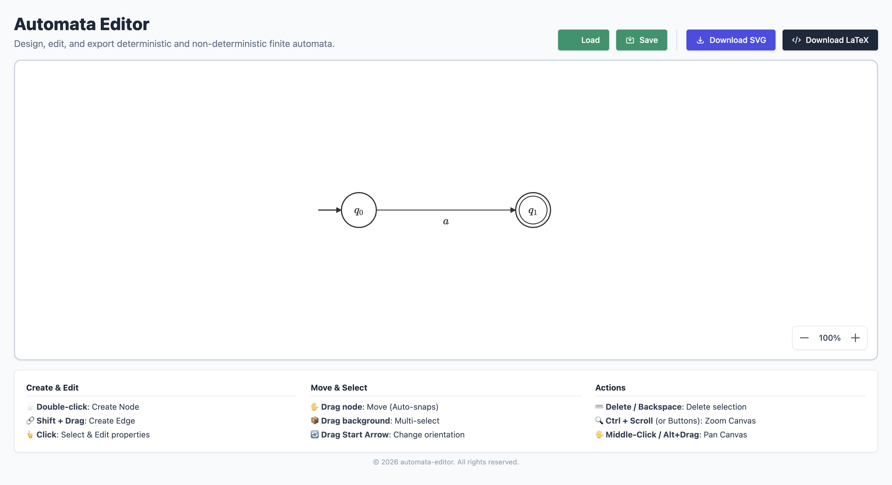

<div align="center">
  <h1>Automata Editor</h1>
  <p>
    Design, label, and export finite-state automata (DFA/NFA) diagrams — right in your browser, no install required.
  </p>
  <p>
    <a href="https://yaronserlin.github.io/automata-editor/"><strong>▶ Try the live demo</strong></a>
  </p>
</div>

---

## What it does

Automata Editor turns the tedious part of drawing state diagrams — for a homework assignment, a paper, a slide deck, or just to think through a design — into a few clicks. Draw states, connect them with labeled transitions, type math with LaTeX-style shortcuts (`q_0`, `\epsilon`, `\rightarrow`), and export a clean diagram when you're done.

Everything runs locally in your browser. Nothing you draw is uploaded anywhere.

## Features

- **Click-to-build canvas** — double-click to add a state, drag to connect or reposition, drag empty space to multi-select.
- **Math-aware labels** — state names and transition labels render live with KaTeX, so `q_0` and `\epsilon` look the way they would in a textbook.
- **Automatic layout smarts** — overlapping transitions curve apart automatically, dragged states snap into alignment with their neighbors.
- **Test your automaton** — type an input string and see whether it is accepted, or step through it symbol by symbol while the active states light up. Works for DFAs and NFAs, including ε-transitions.
- **Never lose work** — the diagram is autosaved in your browser, with undo/redo (`Ctrl`/`Cmd` + `Z`) for every change.
- **Full keyboard support** — every action (create, select, connect, reshape, delete) has a keyboard shortcut, for accessibility or just speed. See [Keyboard shortcuts](#keyboard-shortcuts) below.
- **Save and reload your work** — your diagram is kept in the browser automatically, and you can export it to a JSON file and load it back in later.
- **Export to SVG** — a clean, cropped image ready to drop into a document or slide.
- **Export to LaTeX/TikZ** — ready-to-compile source using the standard `tikz` and `automata` packages, for papers written in LaTeX.

## Screenshot



<video controls width="800" playsinline muted aria-label="Screen recording of the Automata Editor interface, showing a user creating and editing a state machine diagram in a browser.">
  <source src="media/demo.mov" type="video/quicktime" />
  Your browser does not support the video tag.
</video>

## How to use it

1. **Add a state** — double-click anywhere on the canvas.
2. **Connect two states** — hold `Shift` and drag from one state to another, or double-click a state and then drag to (or click) its target.
3. **Edit a state or transition** — click it; a panel opens where you can rename it, mark it as a start/accept state, or edit its label.
4. **Reshape a transition** — drag its label to bend the curve, or drag a self-loop to rotate it.
5. **Move things around** — drag a state to reposition it; drag an empty area to box-select several states at once.
6. **Pan and zoom** — `Alt` + drag (or the middle mouse button) to pan; `Ctrl`/`Cmd` + scroll, or the on-canvas buttons, to zoom.
7. **Delete something** — select it and press `Delete` or `Backspace`.
8. **Test an input** — type a string in **Test input** and press `Enter` (or **Run**); use the step and play buttons to watch the run one symbol at a time.
9. **Undo mistakes** — `Ctrl`/`Cmd` + `Z` to undo, `Ctrl`/`Cmd` + `Shift` + `Z` (or `Ctrl` + `Y`) to redo.
10. **Save your work** — click **Save** to download a project file; click **Load** to bring it back later.
11. **Export a finished diagram** — **Download SVG** for an image, or **Download LaTeX** for TikZ source.

### Keyboard shortcuts

Every editing action is also reachable without a mouse:

| Key | Action |
|---|---|
| `N` | Create a new state at the center of the view |
| `[` / `]` | Select the previous / next state or transition |
| Arrow keys | Move the selected state(s) (hold `Shift` to nudge by 1px) |
| `Enter` | Start drawing a transition from the selected state; press again on another state to connect it (or the same state, for a self-loop) |
| `+` / `-` | Bend the selected transition's curve (or rotate a self-loop) |
| `0` | Reset the selected transition's shape |
| `Escape` | Cancel a transition in progress, or clear the selection |
| `Delete` / `Backspace` | Delete the current selection |
| `Ctrl`/`Cmd` + `Z` | Undo |
| `Ctrl`/`Cmd` + `Shift` + `Z`, `Ctrl` + `Y` | Redo |

## License

Distributed under the MIT License. See `LICENSE` for more information.

---

<details>
<summary><strong>For developers: running this project locally</strong></summary>

<br/>

The app is plain JavaScript (ES modules, no framework, no bundler) with Tailwind CSS compiled ahead of time. Its source is organized by responsibility: `js/core` (the automaton data model), `js/geometry` (pure math/text helpers), `js/interaction` (camera, selection, mouse/touch, and keyboard controllers), `js/rendering` (SVG drawing), `js/ui` (the properties panel), and `js/io` (save/load and SVG/TikZ export), composed together in `js/AutomataEditorApp.js`.

**Setup:**
```bash
git clone https://github.com/yaronserlin/automata-editor.git
cd automata-editor
npm install
npm run build:css   # regenerate css/tailwind.generated.css after editing index.html's classes
```

**Run it:**
```bash
npx serve .
# or: python3 -m http.server 8000
```
Then open the printed `localhost` URL in your browser.

**Test it:**
```bash
npm test
```
The Vitest suite covers the automaton model (state/transition creation and validation), the pure geometry and text-escaping helpers, and the selection-cycling logic.

**Contributing:** fork the project, create a feature branch, and open a pull request. See [docs/CONTRIBUTING.md](docs/CONTRIBUTING.md) for the full scripts reference, testing guide, and PR checklist, and [docs/RUNBOOK.md](docs/RUNBOOK.md) for deployment, rollback, and troubleshooting.

</details>
